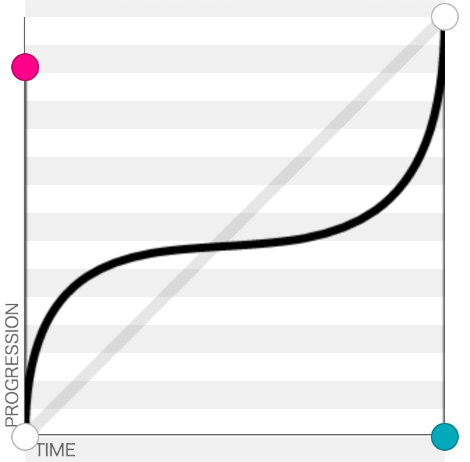

# How to Reproduce the Attract-Screen

Before I start, I should mention that if you know how to read CSS then this
document is horribly convoluted and will only serve to confuse you. I would
recommend that you simply look at the stylesheet in [attract.html](attract.html)

The attract-screen can be split into five components that should be superimposed.

1. <a href="#section-1">the background video</a>
1. <a href="#section-2">the static images (i.e. the title banner)</a>
1. <a href="#section-3">the animated quote images</a>
1. <a href="#section-4">the animated videos</a>
1. <a href="#section-5">the animation for the quotes and videos</a>

This document will specify ***exactly*** how each of these should be constructed.
When you are making the video you should also remember...

1. Use **only** files I have provided in this archive - otherwise my sizing
information (which has been carefully calculated based on the reference material) will not work.
1. If you modify anything **do not modify sizes**, for the same reason as above.
1. The video you output must be the size of [the ViewSonic screen](http://www.viewsonic.com.au/products/lcd/TD2420.php), which I believe
is conveniently the definition of 1080p.
1. The output video must be oriented vertically. I only mention this
because the original background video I received was horizontal.
1. The video will be rendered fullscreen so please **do not use any black bars in the top, bottom, or sides.**

<h3 id="section-0">&#x00a7; Zero - How to Read This</h3>

All percentages in the following tables refer to a fraction of the corresponding
dimension of the video size. For example, "height = 20%" would mean that
some image's height should be one fifth of the total height of the video.

Whenever an attribute is given as "auto" that means that enough information
has been given to define the element's frame ***under the assumption that aspect
ratio should be preserved.*** For example, if an image has an intrinsic size of
1000x500 and I specify width = 500 and height = auto, then the height should
be 250, according to the *aspect ratio* of the original image.

If I give specifications contradicting an element's intrinsic aspect ratio,
you should disregard the intrinsic proportions and force the element to
fit in the frame defined in the following tables.

<h3 id="section-1">&#x00a7; 1 - The Background Video</h3>

The background video is a pretty simple thing to construct. Use the file
[background-vertical-1.mp4](resources/attract-screen/background-vertical-1.mp4) from the resources/attract-screen directory
as the source for the video. The video should simply fill the screen, and so
should be added in full to the 1080p output. Obviously, the z-position should be
zero because this video should be in the background.

<h3 id="section-2">&#x00a7; 2 - The Static Images</h3>

There are three static images that need to be added on top of the background
video. Their sources and placement are specified here. All files may be found
in the resources/attract-screen directory. The z-position for all these images
should be 1. **Do not convert images to another file format** because their
alpha channel is important to make them look good.

<table>
    <caption>
        <h4>Static Image Specifications</h4>
    </caption>
    <thead>
        <tr>
            <th>Description</th>
            <th>Source File Name</th>
            <th>Min X</th>
            <th>Min Y</th>
            <th>Max Y</th>
            <th>Width</th>
            <th>Height</th>
        </tr>
    </thead>
    <tbody>
        <tr>
            <td>Title Image</td>
            <td>
                <a href="resources/attract-screen/title.png">title.png</a>
            </td>
            <td>0%</td>
            <td>0%</td>
            <td>auto</td>
            <td>100%</td>
            <td>auto</td>
        </tr>
        <tr>
            <td>Touch to Start</td>
            <td>
                <a href="resources/attract-screen/touchtobegin.png">touchtobegin.png</a>
            </td>
            <td>22.5%</td>
            <td>auto</td>
            <td>4%</td>
            <td>55%</td>
            <td>auto</td>
        </tr>
        <tr>
            <td>Video Attribution</td>
            <td>
                <a href="resources/attract-screen/attribution.png">attribution.png</a>
            </td>
            <td>20.5%</td>
            <td>auto</td>
            <td>1.5%</td>
            <td>59%</td>
            <td>auto</td>
        </tr>
    </tbody>
</table>

<h3 id="section-3">&#x00a7; 3 - The Animated Quote Images</h3>

**NOTE:** this section only describes the initial position of a quote image,
*before any animations are applied.*

Construct a frame with min-x = 100%, min-y = 55%, width = 65%, height = auto.
This initial frame is outside of the viewport of the video, and that is intentional.
Take this frame and rotate it 16&deg; clockwise *about its bottom left corner*.
The result is the starting position for every frame at the beginning of the animation
that will be defined in <a href="#section-5">section five</a>.

<table>
    <caption>
        <h4>Sources for Quote Images</h4>
    </caption>
    <thead>
        <tr>
            <th>Quote No.</th>
            <th>Source File</th>
        </tr>
    </thead>
    <tbody>
        <tr>
            <td>1</td>
            <td>
                <a href="resources/attract-screen/quote-1.png">quote-1.png</a>
            </td>
        </tr>
        <tr>
            <td>2</td>
            <td>
                <a href="resources/attract-screen/quote-2.png">quote-2.png</a>
            </td>
        </tr>
        <tr>
            <td>3</td>
            <td>
                <a href="resources/attract-screen/quote-3.png">quote-3.png</a>
            </td>
        </tr>
        <tr>
            <td>4</td>
            <td>
                <a href="resources/attract-screen/quote-4.png">quote-4.png</a>
            </td>
        </tr>
    </tbody>
</table>

<h3 id="section-4">&#x00a7; 4 - The Animated Videos</h3>

**NOTE:** this section only describes the initial position of a video,
*before any animations are applied.*

Construct a frame with max-x = 0%, min-y = 35.6%, width = 70.3%, height = auto.
The statement "max-x = 0%" means that the right edge of this frame is aligned with the
left edge of the video's viewport. Rotate the frame 9&deg; counterclockwise
*about its bottom right corner*. This is the starting point for all
video animations defined in <a href="#section-5">section five</a>.

#### Video Borders

It is important that the videos in the animation have solid black black
borders. They do not contrast the background video enough without
these borders. However my CSS only specifies the border be solid and
black, so I don't know exactly how thick the border should be. This will
be up to you to determine.

<table>
    <caption>
        <h4>Sources for Animated Videos</h4>
    </caption>
    <thead>
        <tr>
            <th>Video No.</th>
            <th>Source File</th>
        </tr>
    </thead>
    <tbody>
        <tr>
            <td>1</td>
            <td>
                <a href="resources/attract-screen/subvideo-1.mp4">subvideo-1.mp4</a>
            </td>
        </tr>
        <tr>
            <td>2</td>
            <td>
                <a href="resources/attract-screen/subvideo-2.mp4">subvideo-2.mp4</a>
            </td>
        </tr>
        <tr>
            <td>3</td>
            <td>
                <a href="resources/attract-screen/subvideo-3.mp4">subvideo-3.mp4</a>
            </td>
        </tr>
        <tr>
            <td>4</td>
            <td>
                <a href="resources/attract-screen/subvideo-2.mp4">subvideo-2.mp4</a>
            </td>
        </tr>
    </tbody>
</table>

<h3 id="section-5">&#x00a7; 5 - The Animation Definitions</h3>

Quotes and videos animate together in four blocks, corresponding to the order
of video and image sources in the preceding tables. The duration of each
animation block is equal to the duration of the video file
used in that block. When the fourth block completes the cycle restarts (the
first animation block begins again).

For each animation block, the quote image starts in the <a href="#section-3">position defined in section three</a>
and the video element starts in the <a href="#section-4">position defined in section four</a>. For
both elements, any rotation applied to their initial frame should be removed, leaving
the element perfectly upright at the end of the animation. This means the video is rotated
9&deg; clockwise and the quote is rotated 16&deg; counterclockwise.

The quote is translated left until x-min = -61.4% at the end of the animation.
The video is translated right until x-max = 171%. This bring both elements on
screen and then back off again.

#### Timing the Animations

The animation timing should be defined by a cubic bezier curve.

Using a coordinate system of (abscissa, ordinate) = (time, animation progress), let
the start of the animation be at point (0, 0) and the end of the animation
be at point (1, 1). The first control point should then be (0, .88). The second
control point should be at (1, 0). This produces an animation curve
corresponding to the following graph shown in the following graph.

 

The white dots are the endpoints of the animation. The magenta dot is the
first control point. THe turquoise dot is the second control point.

**In the language of CSS** this is defined by `cubic-bezier(0,.88,1,0)`. I'm not
sure if that's helpful to you at all but I don't know how to describe a
bezier timing function in any language other than math or CSS.